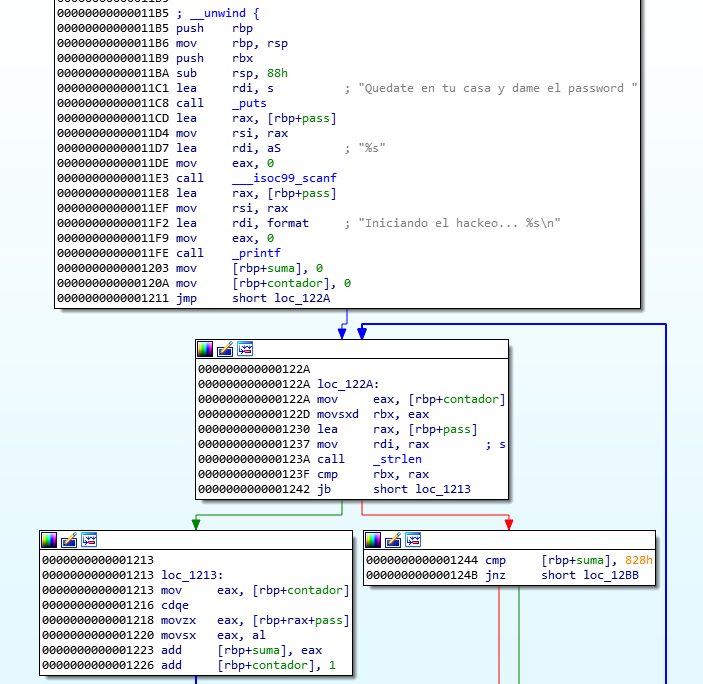

# Write-up CuarenTeFa

## Esteganografía - wellHidden - 300
<p align="center">
  
</p>

La salida de file me dice que es un COFF. Abro el archivo con hexeditor y al momento veo la cadena "JFIF", por lo que sospecho que se trata de una imagen en formato JPEG. Hago una comparación de los primeros bytes del archivo con una muestra de un JPEG real, y veo que solo han cambiado los 3 primeros bytes para que concuerden con la firma del formato COFF que indicaba file.

Con hexeditor cambio estos bytes y renombro el archivo a mensaje.jpg, y visualizo la imagen:

<p align="center">
  
</p>

No veo la flag por ningún sitio. Pruebo a lanzarle un binwalk, un strings y un exiftool, pero no veo nada. Le paso por Stegsolve para ver si está oculta de forma visual en los bits menos significativos, pero tampoco nada. Mi siguiente opción es steghide, pruebo con algunas claves al azar y con la vacía, pero nada. Paso a usar <a href="https://github.com/Paradoxis/StegCracker" target="_blank">StegCracker</a> con el diccionario rockyou y bingo. Veo que los datos extraídos son una cadena codificada en Base32.

<p align="center">
  
</p>

**Flag: intente_esconderme_pero_no_pude**


## Esteganografía - CovertChannel - 350
<p align="center">
  
</p>

Este reto fue más sencillo de lo que esperaba, lo cual me disgustó un poco. Con un simple strings a la captura del tráfico salía la flag.

<p align="center">
  
</p>

Por mera curiosidad, con Wireshark veo que la flag estaba contenida en el campo Data de un ping.

**Flag: menudo_covert_channel_nos_hemos_montado**


## Esteganografía - Fusion - 550
<p align="center">
  
</p>

La salida de file me indica que es un JPEG. Verifico que de verdad es una imagen en el visor de Windows, pero veo que pasa algo raro al desplazar la imagen en él. Binwalk detecta el final de un archivo zip al final de la imagen. 

<p align="center">
  
</p>

Utilizo la herramienta <a href="https://mh-nexus.de/en/hxd/" target="_blank">HxD</a> para analizar con más comodidad el archivo y en efecto veo que parece haber un ZIP camuflado al final del archivo.

<p align="center">
  
</p>

La salida de binwalk no detectó la cabecera del ZIP, por lo que pienso que la habrán modificado. Con una búsqueda sobre la firma de ZIP veo que suele ser **"50 4B 03 04"**, aunque los 2 últimos bytes pueden cambiar dependiendo de si es un formato basado en ZIP. Busco la secuencia **"03 04"** (hexadecimal) y hay una coincidencia en la parte final del archivo. Verifico que se trata de la firma porque el byte anterior es **"4B"** y el primer byte lo han modificado a **"FF"**. Extraigo los datos parcheando el primer byte a **"50"** y trato de descomprimir el ZIP, pero veo que tiene contraseña. Con fcrackzip no tarda ni un segundo en encontrarla en rockyou:

<p align="center">
  
</p>

**Flag: que_demonios_ha_sido_esto**


## Web - NSAWebPanel - 400

No conseguí resolverlo. Con wfuzz logré sacar que el usuario era "single" ya que el mensaje de error era distinto, pero con la contraseña no tuve suerte.

**No flag :(**


## Reversing - Sombra - 300
<p align="center">
  
</p>

Con file veo que se trata de un ELF de 64 bits. Lo abro con IDA:

En el entry point se ve que está todo lo que hay que reversear y la chicha está en pocas líneas.

<p align="center">
  
</p>

En resumen, imprime el prompt, recibe una contraseña, la muestra por pantalla en un mensaje posturetas y realiza una suma de los bytes de la contraseña. Si dicha suma es equivalente a 2088, muestra la flag contenida en el archivo "flag.txt".

<p align="center">
  
</p>

Como no hay ninguna restricción de longitud ni nada, me pico una función en la consola de Python y voy probando cadenas hasta que doy con el valor que necesito.

<p align="center">
  
</p>

**Flag: Qu3d4t3_3n_Tu_C4s4plz!!!!**

## Pwn - HELP! - 100
<p align="center">
  
</p>

Me conecté por netcat a la ip y puerto especificados. Tras varias conexiones fallidas consigo conectar y veo que devuelve varios caracteres extraños, los cuales son 4 números enviados en su formato binario.

Nunca había probado la herramienta <a href="https://github.com/Gallopsled/pwntools" target="_blank">pwntools</a>, y por su documentación vi que podía resolver este reto con facilidad, por lo que me la instalé e hice un script chapucero en Python que mostraba la suma, la metía en la calculadora de Windows con tamaño DWORD para que tuviese en cuenta el overflow que se producía. No había límite de tiempo y me daba pereza hacerlo en Python, ¿vale?

```
from pwn import *

conn = remote("64.227.14.182", 4455)
s = conn.recv()

num1 = s[0:4]
num2 = s[4:8]
num3 = s[8:12]
num4 = s[12:16]
print u32(num1), "+", u32(num2), "+", u32(num3)," +", u32(num4)
suma = int(raw_input(">"))
conn.send(p32(suma) + "\n")
print conn.recv()
```

**Se me olvidó pillar la flag y no la recuerdo.**

## Pwn - Apruebo - 300

No conseguí resolverlo, no encontré la forma de hacer un leak a la dirección base de la librería en el servidor. La explotación era un ret2libc de libro.

**No flag :(**

## Criptografía - RobustCrypted - 300
<p align="center">
  
</p>

Con file veo que se trata de un archivo cifrado con openssl y una contraseña. Encuentro rápido la solución con una herramienta de fuerza bruta para la contraseña: <a href="https://github.com/glv2/bruteforce-salted-openssl" target="_blank">bruteforce-salted-openssl</a>. La descripción del reto dice que da igual el algoritmo que se haya usado, por lo que se me ocurre que tiene algo que ver con el tipo de digest. El primero que pruebo es SHA-256, que resulta ser el utilizado y la contraseña es de las primeras en rockyou.

<p align="center">
  
</p>

**Flag: a_veces_da_igual_el_algoritmo_que_emplees**
