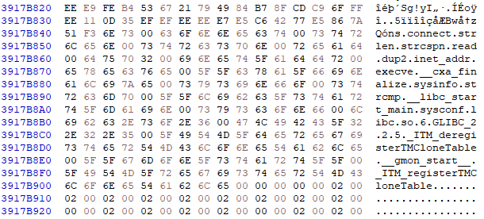
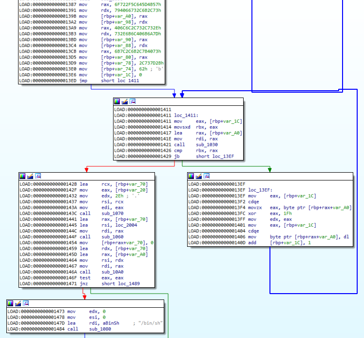

# Write-up HTB Business CTF 2022

- [Write-up HTB Business CTF 2022](#write-up-htb-business-ctf-2022)
  - [Forensics - SquatBot](#forensics---squatbot)

## Forensics - SquatBot 
🩸 **First Blood**

> An AWS development company that provides full-scale cloud consulting and AWS application development services has recently been compromised. They try to maintain cyber hygiene by applying numerous procedures and safe development practices. To this day, they are unaware of how malware could penetrate their defenses. We have managed to obtain a memory dump and isolate the compromised server. Can you analyze the dump and examine the malware's behavior?

The challenge download included a memory dump and a ZIP file from a custom Ubuntu profile for Volatility. After putting the custom Volatility profile on the volatility/plugins/overlays/linux directory, I could analyze the memory dump.

The linux_bash command showed that the repository https://github.com/bootooo3/boto3 was cloned and installed with Python. 


<p align="center">
  <br>
  <code>vol.py -f dump.mem --profile=LinuxUbuntu_4_15_0-184-generic_profilex64 linux_bash</code>
</p>


Taking a look at the repository, I saw that it was new and had no stars. However, it had a nice formatted README claiming:

Boto3 is the Amazon Web Services (AWS) Software Development Kit (SDK) for Python, which allows Python developers to write software that makes useof services like Amazon S3 and Amazon EC2. You can find the latest, mostup to date, documentation at our doc site, including a list ofservices that are supported.

I found that the original boto3 project wass located on https://github.com/boto/boto3, so it appeared to be an impersonation with some malicious code inside. The file CHANGELOG.rst from the fake repository says that the last version is 1.24.9. I cloned the original repository and went back to a commit from that version (original was on 1.24.31).

```
git clone https://github.com/boto/boto3
git reset --hard 39aa8e2ebe26105a3153f1df01e27bf7fad4fe74
```

Now I can compare the contents from both fake and original repositories with tools like Meld, for example.

<p align="center">
  
</p>

Apart from some git related differences, setup.py was detected to have different contents: on the first line, some B64 was being decoded and executed.

<p align="center">
  
</p>
<p align="center">
  
</p>


Analyzing the code, I see that a connection to a certain host and port is made. Then, syscall 319 is called. Taking a look into the documentation, I see that it's memfd_create.

<p align="center">
  
</p>


Then, the malware enters a loop where it receives data from the connection, XOR that data with decimal key 239 and writes the resulting bytes to the created anonymous file on memory.
Finally it does a C2 callback to files.pypi-install.com with some info of the compromised host and runs the malware if C2 returns "Ok".

The host from where the XORed malware was received was down, so the only way to see what was run on the machine was to recover it from memory.

At this point I blocked for a while, enumerating files looking for file descriptors in /proc, llisting and dumping proc_maps from the python3 and other processes, looking for loaded ELFs in dynamic sections, with no progress.

After some time, the idea that the received data connection might still be available in the memory came to my mind, as the python3 process was still running. This data should be encrypted with key 239, and instead of keep dumping things I just decided to XOR the entire memory dump with that key. If the data was still there, I should be able to find some data like ELF headers, strings and so. And I did.

<p align="center">
  
</p>


However, the found ELF was not complete. Instead several pieces were scattered in blocks of 0x5A0 bytes with some rubbish bytes in middle (0x1E0 blocks), apparently in reverse order:


<p align="center">
  
</p>

<p align="center">
  
</p>

So I recovered these blocks and write them to a file.

<p align="center">
  
</p>

Then I loaded it on IDA, apart from an error seemed to be correct and I analyzed the function that referenced the "bin/sh" string. There I found a loop that XORed some data with the 0x1F key.

<p align="center">
  
</p>

That decrypted data was the flag:

<p align="center">
  
</p>
